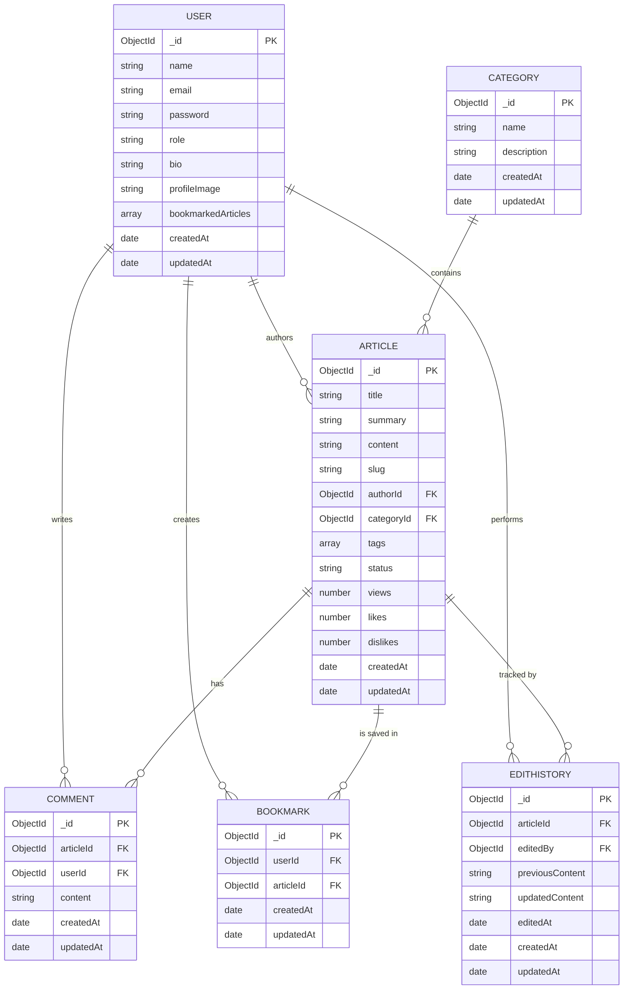

```mermaid
erDiagram
    USER ||--o{ ARTICLE : "authors"
    USER ||--o{ COMMENT : "writes"
    USER ||--o{ BOOKMARK : "creates"
    USER ||--o{ EDITHISTORY : "performs"
    
    CATEGORY ||--o{ ARTICLE : "contains"
    
    ARTICLE ||--o{ COMMENT : "has"
    ARTICLE ||--o{ BOOKMARK : "is saved in"
    ARTICLE ||--o{ EDITHISTORY : "tracked by"

    USER {
        ObjectId _id PK
        string name
        string email
        string password
        string role
        string bio
        string profileImage
        array bookmarkedArticles
        date createdAt
        date updatedAt
    }

    ARTICLE {
        ObjectId _id PK
        string title
        string summary
        string content
        string slug
        ObjectId authorId FK
        ObjectId categoryId FK
        array tags
        string status
        number views
        number likes
        number dislikes
        date createdAt
        date updatedAt
    }

    CATEGORY {
        ObjectId _id PK
        string name
        string description
        date createdAt
        date updatedAt
    }

    COMMENT {
        ObjectId _id PK
        ObjectId articleId FK
        ObjectId userId FK
        string content
        date createdAt
        date updatedAt
    }

    BOOKMARK {
        ObjectId _id PK
        ObjectId userId FK
        ObjectId articleId FK
        date createdAt
        date updatedAt
    }

    EDITHISTORY {
        ObjectId _id PK
        ObjectId articleId FK
        ObjectId editedBy FK
        string previousContent
        string updatedContent
        date editedAt
        date createdAt
        date updatedAt
    }
```
