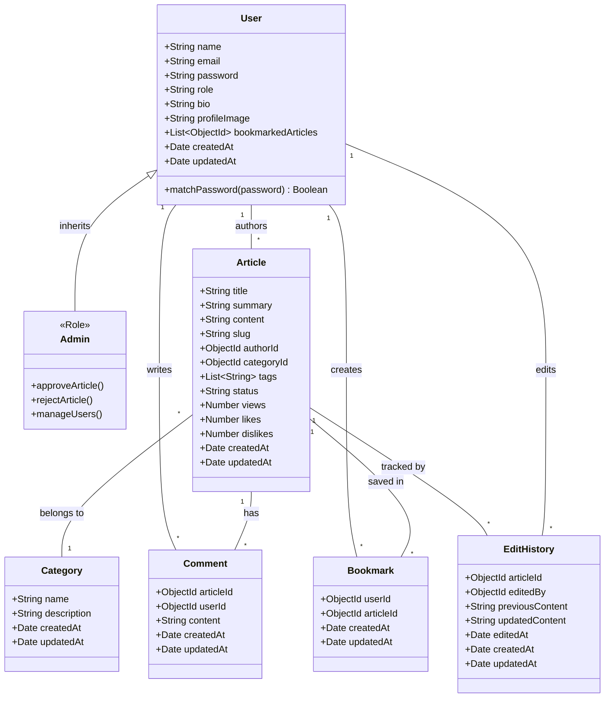

```mermaid
classDiagram
    class User {
        +String name
        +String email
        +String password
        +String role
        +String bio
        +String profileImage
        +List~ObjectId~ bookmarkedArticles
        +Date createdAt
        +Date updatedAt
        +matchPassword(password) Boolean
    }

    class Admin {
        <<Role>>
        +approveArticle()
        +rejectArticle()
        +manageUsers()
    }

    class Article {
        +String title
        +String summary
        +String content
        +String slug
        +ObjectId authorId
        +ObjectId categoryId
        +List~String~ tags
        +String status
        +Number views
        +Number likes
        +Number dislikes
        +Date createdAt
        +Date updatedAt
    }

    class Comment {
        +ObjectId articleId
        +ObjectId userId
        +String content
        +Date createdAt
        +Date updatedAt
    }

    class Category {
        +String name
        +String description
        +Date createdAt
        +Date updatedAt
    }

    class Bookmark {
        +ObjectId userId
        +ObjectId articleId
        +Date createdAt
        +Date updatedAt
    }

    class EditHistory {
        +ObjectId articleId
        +ObjectId editedBy
        +String previousContent
        +String updatedContent
        +Date editedAt
        +Date createdAt
        +Date updatedAt
    }

    User "1" -- "*" Article : authors
    User "1" -- "*" Comment : writes
    User "1" -- "*" Bookmark : creates
    User <|-- Admin : inherits
    Article "*" -- "1" Category : belongs to
    Article "1" -- "*" Comment : has
    Article "1" -- "*" Bookmark : saved in
    Article "1" -- "*" EditHistory : tracked by
    User "1" -- "*" EditHistory : edits
```
