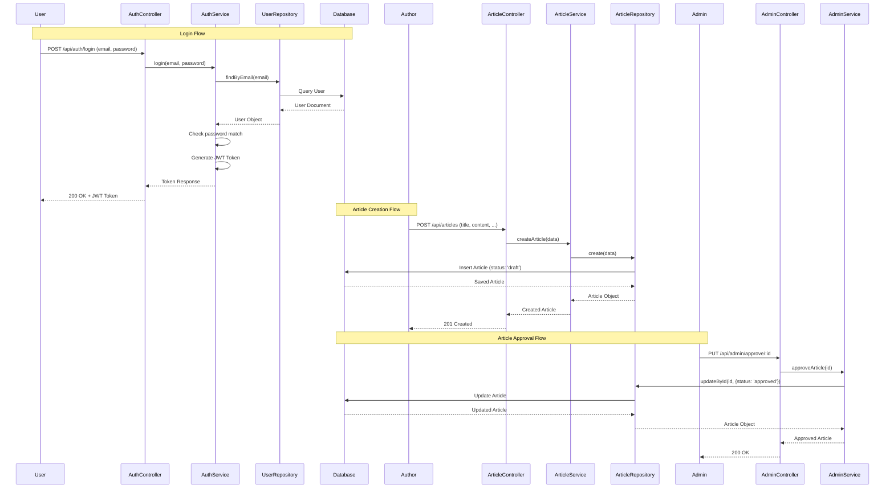

```mermaid
sequenceDiagram
    participant User
    participant AuthController
    participant AuthService
    participant UserRepository
    participant Database

    Note over User,Database: Login Flow
    User->>AuthController: POST /api/auth/login (email, password)
    AuthController->>AuthService: login(email, password)
    AuthService->>UserRepository: findByEmail(email)
    UserRepository->>Database: Query User
    Database-->>UserRepository: User Document
    UserRepository-->>AuthService: User Object
    AuthService->>AuthService: Check password match
    AuthService->>AuthService: Generate JWT Token
    AuthService-->>AuthController: Token Response
    AuthController-->>User: 200 OK + JWT Token

    participant Author
    participant ArticleController
    participant ArticleService
    participant ArticleRepository
    
    Note over Author,Database: Article Creation Flow
    Author->>ArticleController: POST /api/articles (title, content, ...)
    ArticleController->>ArticleService: createArticle(data)
    ArticleService->>ArticleRepository: create(data)
    ArticleRepository->>Database: Insert Article (status: 'draft')
    Database-->>ArticleRepository: Saved Article
    ArticleRepository-->>ArticleService: Article Object
    ArticleService-->>ArticleController: Created Article
    ArticleController-->>Author: 201 Created

    participant Admin
    participant AdminController
    participant AdminService
    
    Note over Admin,Database: Article Approval Flow
    Admin->>AdminController: PUT /api/admin/approve/:id
    AdminController->>AdminService: approveArticle(id)
    AdminService->>ArticleRepository: updateById(id, {status: 'approved'})
    ArticleRepository->>Database: Update Article
    Database-->>ArticleRepository: Updated Article
    ArticleRepository-->>AdminService: Article Object
    AdminService-->>AdminController: Approved Article
    AdminController-->>Admin: 200 OK
```
